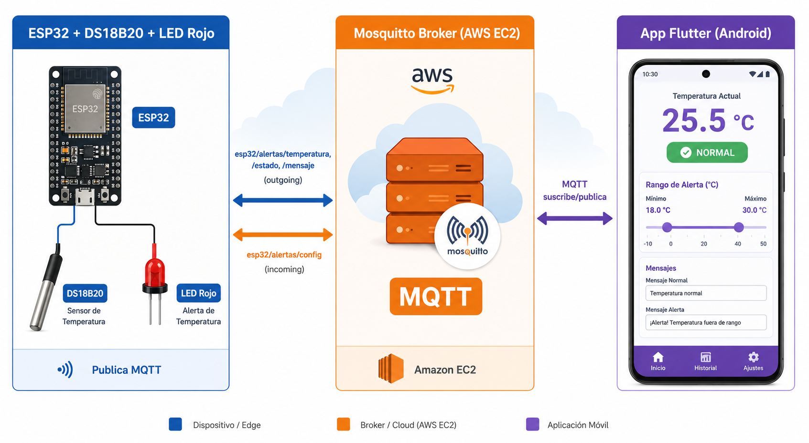
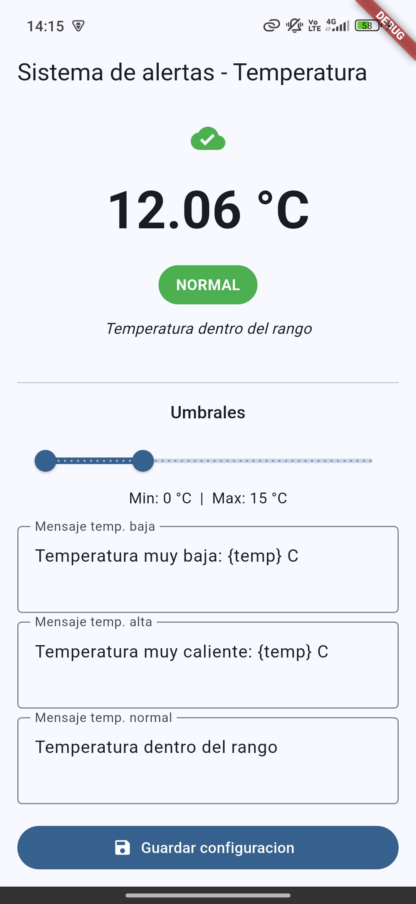
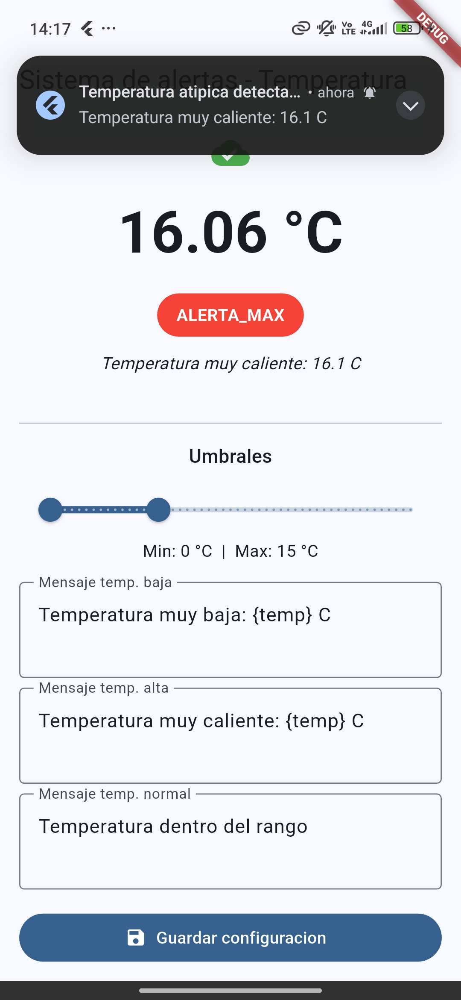

# Sistema de Alertas de Temperatura en Tiempo Real

Sistema IoT que lee temperatura con un sensor DS18B20 en un ESP32, la publica vía MQTT a un broker Mosquitto en AWS EC2, activa un LED rojo como alerta local cuando la temperatura sale de un rango configurable, y notifica una app Flutter en tiempo real con sonido y notificaciones persistentes.

---

## Arquitectura General

<p align="center">
  
</p>

---

## Módulo 1 — Hardware y Firmware Base (ESP32)

### Componentes

- ESP32 DevKit
- Sensor DS18B20 (protocolo 1-Wire, digital)
- LED rojo de 5mm
- Resistencia 220Ω (para el LED)
- Resistencia 4.7kΩ (pull-up del DS18B20, solo si el breakout no la trae soldada)

### Conexión Eléctrica

<p align="center">
  
</p>

```
DS18B20:
  + (VCC)  ─── 3.3V (ESP32)
  - (GND)  ─── GND  (ESP32)
  S (DATA) ─── GPIO4 (ESP32)
  ── resistencia 4.7kΩ entre + y S (si no viene soldada)

LED rojo:
  Ánodo (+) ─── GPIO5 (ESP32)
  Cátodo (-) ─── resistencia 220Ω ─── GND (ESP32)
```

### Estructura del Proyecto (PlatformIO)

```
sistema-alertas-temp/
├── .env                         # Credenciales reales (NO se sube a git)
├── .env.example                 # Plantilla de credenciales para nuevos usuarios
├── .gitignore
├── platformio.ini               # Configuración del proyecto
├── scripts/
│   └── load_env.py              # Genera include/secrets.h desde .env
├── include/
│   └── secrets.h                # Generado automáticamente (NO se sube)
├── lib/
│   ├── SensorTemp/              # Lectura del DS18B20
│   │   ├── SensorTemp.h
│   │   └── SensorTemp.cpp
│   ├── LedControl/              # Control del LED rojo
│   │   ├── LedControl.h
│   │   └── LedControl.cpp
│   ├── WifiManager/             # Conexión WiFi
│   │   ├── WifiManager.h
│   │   └── WifiManager.cpp
│   └── MqttManager/             # Cliente MQTT (PubSubClient) con callback
│       ├── MqttManager.h
│       └── MqttManager.cpp
└── src/
    └── main.cpp                 # Punto de entrada, orquesta todos los módulos
```

### Dependencias (`platformio.ini`)

- `paulstoffregen/OneWire @ ^2.3.7` — protocolo 1-Wire
- `milesburton/DallasTemperature @ ^3.11.0` — driver para sensores Dallas (DS18B20)
- `knolleary/PubSubClient @ ^2.8` — cliente MQTT ligero para ESP32
- `bblanchon/ArduinoJson @ ^7.0.0` — parseo de configuración JSON vía MQTT

### Gestión de Credenciales (`.env`)

Las credenciales sensibles (WiFi, MQTT) se configuran en `.env` (excluido de git). Usá `.env.example` como plantilla:

```env
WIFI_SSID=TuRedWiFi
WIFI_PASSWORD=TuClaveWiFi
MQTT_BROKER_HOST=192.168.1.100
MQTT_BROKER_PORT=1883
MQTT_USER=esp32_alertas
MQTT_PASSWORD=tu_password_mqtt
```

Renombrá `.env.example` a `.env` y completá con tus credenciales reales. Al compilar, `scripts/load_env.py` lee `.env` y genera `include/secrets.h` automáticamente. Ambos archivos están excluidos de git (`.gitignore`).

### Funcionamiento (Módulo 4 - configurable)

1. En `setup()` se cargan umbrales y mensajes desde NVS (`Preferences.h`).
2. Se conecta a WiFi y al broker MQTT.
3. Se suscribe a `esp32/alertas/config` para recibir configuración desde Flutter.
4. Cada 2 segundos lee el DS18B20 y compara contra `[umbralMin, umbralMax]`:
   - `temp < min` → `ALERTA_MIN`, LED encendido, publica mensaje de "baja"
   - `temp > max` → `ALERTA_MAX`, LED encendido, publica mensaje de "alta"
   - Dentro del rango → `NORMAL`, LED apagado
5. Publica en tres tópicos: `temperatura` (float), `estado` (ALERTA_MIN/ALERTA_MAX/NORMAL), `mensaje` (texto con `{temp}` interpolado).
6. Al recibir un JSON en `esp32/alertas/config`, guarda los nuevos valores en NVS y los aplica inmediatamente.
7. Los umbrales y mensajes persisten ante reinicios del ESP32.

---

## Módulo 2 — Broker MQTT + Conexión WiFi del ESP32

### Infraestructura

- **Servidor:** Instancia Ubuntu en AWS EC2 (IP: `<BROKER_IP>`)
- **Broker:** Mosquitto v2.0.22
- **Puerto:** 1883 (MQTT estándar, sin TLS por ahora)
- **Autenticación:** usuario/contraseña (`esp32_alertas` / `tu_password_mqtt`)

### Instalación en la EC2

```bash
sudo apt update
sudo apt install -y mosquitto mosquitto-clients
```

### Configuración

Archivo: `/etc/mosquitto/conf.d/sistema-alertas.conf`

```conf
listener 1883
allow_anonymous false
password_file /etc/mosquitto/passwd
```

Crear usuario:

```bash
sudo mosquitto_passwd -c /etc/mosquitto/passwd esp32_alertas
```

Permisos (corrección necesaria en Mosquitto v2):

```bash
sudo chown mosquitto:mosquitto /etc/mosquitto/passwd
sudo chmod 640 /etc/mosquitto/passwd
sudo systemctl restart mosquitto
sudo systemctl enable mosquitto
```

### Regla de Firewall (AWS Security Group)

| Tipo | Puerto | Fuente | Descripción |
|------|--------|--------|-------------|
| Custom TCP | 1883 | `0.0.0.0/0` | MQTT desde ESP32 y Flutter |

### Tópicos MQTT Definidos

```
esp32/alertas/temperatura   → valor numérico de temperatura en °C
esp32/alertas/estado        → "NORMAL", "ALERTA_MIN" o "ALERTA_MAX"
esp32/alertas/mensaje       → texto descriptivo con {temp} interpolado
esp32/alertas/config        → JSON de configuración (recibido por ESP32)
```

### Complicación y Solución

Al reiniciar Mosquitto por primera vez, falló con **exit code 13** ("Unable to open pwfile"). Causa: el archivo `passwd` fue creado por `root`, pero Mosquitto v2 corre como usuario `mosquitto` y no tenía permisos de lectura. Se solucionó con:

```bash
sudo chown mosquitto:mosquitto /etc/mosquitto/passwd
sudo chmod 640 /etc/mosquitto/passwd
```

### Funcionamiento del Firmware (Módulo 2)

El ESP32 ahora:

1. Se conecta a WiFi al iniciar (usando credenciales de `.env`)
2. Se conecta al broker MQTT en la EC2
3. Cada 2 segundos lee el DS18B20 y publica:
   - `esp32/alertas/temperatura` → valor numérico (ej: `"12.50"`)
   - `esp32/alertas/estado` → `"NORMAL"` o `"ALERTA"` según umbral
4. Reintenta conexión WiFi/MQTT si se pierde la conectividad
5. Controla el LED rojo localmente según el umbral

### Cómo Flashear y Monitorear

```bash
pio run -t upload && pio device monitor
```

### Verificación (Módulo 2)

Salida esperada en el monitor serie:

```
=== Modulo 2: WiFi + MQTT ===
[SensorTemp] Sensores DS18B20 detectados: 1
[WiFi] Conectando a TuRedWiFi
.
[WiFi] Conectado. IP: 10.60.69.216
[MQTT] Conectando a BROKER_IP:1883
[MQTT] Conectado.
Temperatura actual: 12.00 C
[MQTT] Publicado en 'esp32/alertas/temperatura': 12.00 (OK)
[MQTT] Publicado en 'esp32/alertas/estado': NORMAL (OK)
```

Verificación desde laptop:

```bash
mosquitto_sub -h BROKER_IP -p 1883 -u esp32_alertas -P tu_password_mqtt -t "esp32/alertas/#" -v
```

---

## Módulo 3 — App Flutter (MQTT + Alerta Sonora + Notificaciones + Config)

### Estructura del Proyecto

```
flutter_app/
├── pubspec.yaml
├── assets/
│   └── sounds/
│       └── alerta.mp3            # Beep 880Hz x 0.5s generado con Python
└── lib/
    ├── main.dart                  # Punto de entrada
    ├── models/
    │   └── sensor_data.dart       # Modelo SensorData (temperatura + estado + mensaje + timestamp)
    ├── services/
    │   ├── mqtt_service.dart      # Cliente MQTT con publicación y suscripción a 3 tópicos
    │   ├── alert_sound_service.dart  # Alerta sonora (audioplayers)
    │   ├── notification_service.dart # Notificaciones persistentes (flutter_local_notifications)
    │   └── config_service.dart    # Persistencia local + envío de configuración al ESP32
    └── screens/
        └── home_screen.dart       # UI: temperatura, estado, mensaje, sliders, campos de texto
```

### Dependencias (`pubspec.yaml`)

- `mqtt_client: ^10.3.0` — cliente MQTT con autenticación y reconexión automática
- `audioplayers: ^6.1.0` — reproducción de audio en loop para la alerta
- `flutter_local_notifications: ^18.0.0` — notificaciones persistentes en Android
- `shared_preferences: ^2.3.0` — persistencia local de umbrales y mensajes

### Funcionamiento

1. Al iniciar, carga la configuración guardada localmente (umbrales y textos personalizados).
2. Se conecta al broker Mosquitto en `BROKER_IP:1883` con usuario/contraseña.
3. Se suscribe a `esp32/alertas/temperatura`, `esp32/alertas/estado` y `esp32/alertas/mensaje`.
4. Cada mensaje recibido se almacena; cuando temperatura y estado están disponibles, se emite un `SensorData` combinado.
5. La UI muestra:
   - Ícono de nube verde/rojo indicando estado de conexión
   - Temperatura en °C con 2 decimales
   - Etiqueta de estado (`NORMAL` verde, `ALERTA_MIN` o `ALERTA_MAX` rojo)
   - Mensaje descriptivo recibido del ESP32
   - **RangeSlider** (0-50°C) para ajustar umbral mínimo y máximo
   - **3 campos de texto** para mensajes personalizados (temp baja, alta, normal)
   - Botón **Guardar configuración** que persiste localmente y envía JSON al ESP32
6. Si el estado es alerta: reproduce `alerta.mp3` en loop y muestra notificación persistente (no se descarta automáticamente al volver a normal).
7. Si vuelve a `NORMAL`: detiene el sonido, pero la notificación queda visible hasta que el usuario la descarte.

<p align="center">
  
  
</p>

### Bugs Encontrados y Corregidos

| Problema | Causa | Solución |
|----------|-------|----------|
| Nube roja aunque conectado | Race condition: listeners se registraban después de `conectar()` | Mover `.listen()` antes del `await _mqtt.conectar()` |
| Error `use_of_void_result` | Cascade operators con setters en Dart 3.x con mqtt_client | Asignaciones línea por línea con `_cliente!` |
| Posible null crash | `connectionStatus!` sin chequeo nulo | Usar `connectionStatus?.state` |
| Sin conexión en Android 15 | Bloqueo de cleartext traffic | Agregar `android:usesCleartextTraffic="true"` en `AndroidManifest.xml` |
| Celular no conectaba al broker | Security Group solo permitía IP de laptop | Cambiar Source a `0.0.0.0/0` |

### Cómo Ejecutar

```bash
cd flutter_app
flutter pub get
flutter run
```

### Verificación (Módulo 3)

Forzar alerta desde la terminal de tu laptop:

```bash
mosquitto_pub -h BROKER_IP -p 1883 -u esp32_alertas -P tu_password_mqtt \
  -t "esp32/alertas/estado" -m "ALERTA_MAX"
```

La app debe mostrar la etiqueta en rojo, reproducir el pitido en loop y mostrar una notificación persistente. Publicar `NORMAL` detiene el sonido pero no descarta la notificación.

---

## Cómo Probar el Sistema Completo

| Paso | Acción | Resultado esperado |
|------|--------|--------------------|
| 1 | ESP32 se enciende | Publica `NORMAL` en `estado`, LED apagado, Flutter muestra verde |
| 2 | En Flutter: subir el mínimo sobre la temp actual (ej: 30°C) y guardar | ESP32 recibe config, pasa a `ALERTA_MIN`, LED enciende, Flutter rojo + mensaje + sonido + notificación persistente |
| 3 | En Flutter: bajar el mínimo (ej: 5°C) y guardar | LED apagado, estado `NORMAL`, sonido se detiene, notificación sigue visible (descarte manual) |
| 4 | Repetir con el máximo (bajarlo debajo de la temp actual) | `ALERTA_MAX`, LED enciende, mensaje de alta temperatura |
| 5 | Editar mensajes en los campos de texto y guardar | ESP32 interpola `{temp}` al publicar en `mensaje` |

---

## Comandos Útiles

| Acción | Comando |
|--------|---------|
| ESP32 — Flashear | `pio run -t upload` |
| ESP32 — Monitor serie | `pio device monitor` |
| Flutter — Ejecutar | `cd flutter_app && flutter run` |
| Flutter — Obtener dependencias | `cd flutter_app && flutter pub get` |
| Mosquitto — Logs | `sudo journalctl -u mosquitto -f` |
| Mosquitto — Estado | `sudo systemctl status mosquitto` |
| Suscribirse a tópicos | `mosquitto_sub -h <IP> -p 1883 -u <user> -P <pass> -t "<topic>" -v` |
| Publicar un mensaje | `mosquitto_pub -h <IP> -p 1883 -u <user> -P <pass> -t "<topic>" -m "<msg>"` |
| Forzar alerta de prueba | `mosquitto_pub -h BROKER_IP -p 1883 -u esp32_alertas -P tu_password_mqtt -t "esp32/alertas/estado" -m "ALERTA_MAX"` |
| Enviar configuración manual | `mosquitto_pub -h BROKER_IP -p 1883 -u esp32_alertas -P tu_password_mqtt -t "esp32/alertas/config" -m '{"min":20,"max":35,"msg_min":"Frio: {temp} C","msg_max":"Calor: {temp} C","msg_normal":"OK {temp} C"}'` |
